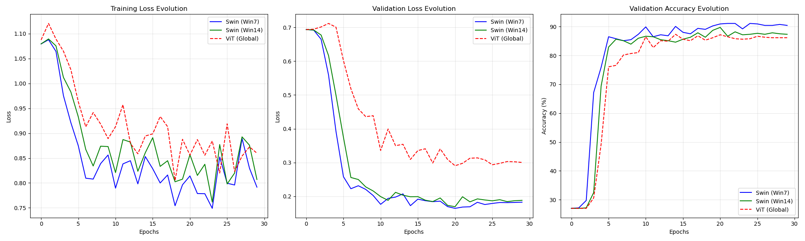
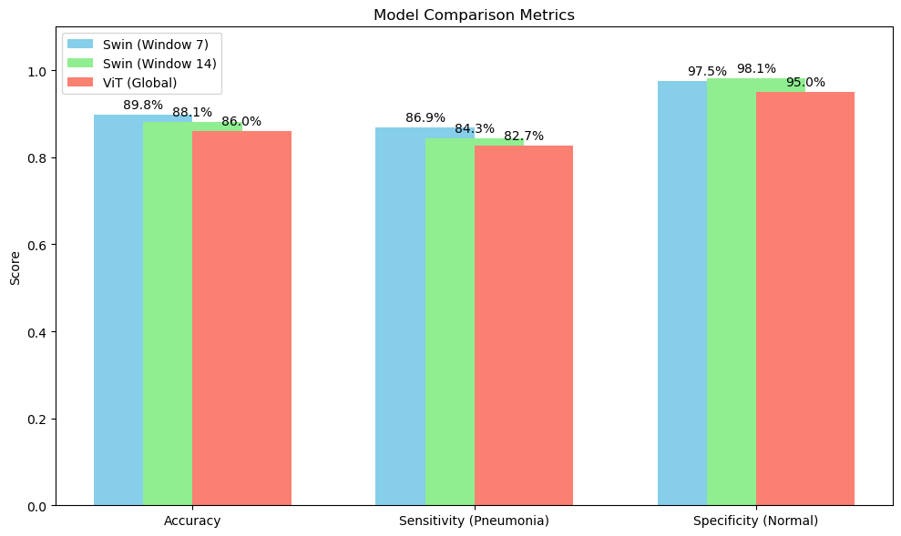

# Pneumonia Detection using Swin Transformer & ViT Complexity Analysis

  

This repository contains a fine-tuned implementation of **Swin Transformer (Tiny)** for classifying Chest X-Ray images (Normal vs. Pneumonia).

Developed for a **Computer Vision** course, this project goes beyond simple classification. It performs a comparative study between **Hierarchical Vision Transformers (Swin)** and **Global Vision Transformers (ViT)**, analyzing the trade-offs between **accuracy**, **inference speed**, and **memory complexity ($O(N)$ vs $O(N^2)$)**.

## Key Features & Modifications

Unlike standard implementations, this project includes custom tools for deep analysis:

* **Swin vs. ViT Simulation**: A unique experimental setup comparing standard Swin (Window 7), Hybrid Swin (Window 14), and a Simulated ViT (Window 56 / Global Attention) using the same backbone.
* **Complexity Benchmarks**: Custom scripts to measure **VRAM usage** and **Inference Latency** across different resolutions, demonstrating the quadratic cost of Global Attention.
* **Apple Silicon Optimization**: Code optimized for local inference on **Mac (M1/M2/M3)** using Metal Performance Shaders (MPS).
* **Modern PyTorch Support**: Patched compatibility for PyTorch 2.x (`weights_only=False` fixes).
* **Advanced Visualization**: Notebooks for Confusion Matrices, Error Analysis, and Grad-CAM (Explainability).

## Dataset

The model is trained on the **Chest X-Ray Images (Pneumonia)** dataset.
* **Classes**: NORMAL, PNEUMONIA
* **Pre-processing**: Images resized to 224x224 (or 384x384 for high-res experiments).
* **Structure**: The code expects the dataset to be organized in `dataset/chest_xray_new/` with `train`, `val`, and `test` subfolders.

*(Note: The dataset is not included in this repo due to size limits. You can download it from Kaggle at https://www.kaggle.com/datasets/paultimothymooney/chest-xray-pneumonia). and place it in `dataset/chest_xray_new/`*

## Usage

### 1. Installation
```bash
git clone [https://github.com/ma3ti/Swin-transformer-ChestXray](https://github.com/ma3ti/Swin-transformer-ChestXray)
cd Swin-Transformer-ChestXray
conda env create -f environment.yaml
conda activate swin
```

### Training (Fine_tuning)
You can run the fine-tuning directly via the provided Jupyter Notebook at `./finetune/Swin__finetuning.ipynb`



### Inference and Evaluation
Run the evaluation script to generate classification reports, confusion matrices and other metrics: `./finetune/test.ipynb`


### Results


